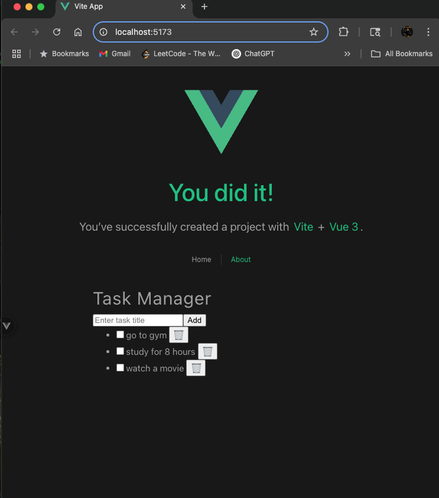

# ✅ VueDo – A Full-Stack Task Manager App

VueDo is a modern and lightweight task management web app built using **Laravel** (PHP) for the backend API and **Vue.js** for the frontend. It allows users to create, update, complete, and delete tasks in a simple and intuitive interface.

---

## 🚀 Features

* 📝 Add, edit, and delete tasks
* ✅ Mark tasks as completed
* 📆 RESTful API with Laravel
* 🎨 Reactive UI with Vue.js
* 🔗 Axios for frontend-backend communication
* 📂 MySQL support with Eloquent ORM
* 🧪 Clean project structure and easy to extend

---

## 🛠️ Tech Stack

| Layer    | Technology          |
| -------- | ------------------- |
| Frontend | Vue.js + Axios      |
| Backend  | Laravel (PHP)       |
| Database | MySQL               |
| Styling  | Tailwind (optional) |

---

## 📁 Project Structure

```
/my-laravel-app     ← Laravel Backend
/src                ← Vue Frontend Components
/routes/api.php     ← API Routes
/TaskController     ← Task API Logic
```

---

## 🧑‍💻 Getting Started

### 📆 Backend Setup (Laravel)

```bash
cd my-laravel-app
composer install
cp .env.example .env
php artisan key:generate

# Set your DB credentials in .env
php artisan migrate
php artisan serve
```

### 🎨 Frontend Setup (Vue)

```bash
cd task-frontend
npm install
npm run dev
```

---

## 🔗 API Endpoints

| Method | Endpoint          | Description       |
| ------ | ----------------- | ----------------- |
| GET    | `/api/tasks`      | Get all tasks     |
| POST   | `/api/tasks`      | Create a new task |
| PUT    | `/api/tasks/{id}` | Update a task     |
| DELETE | `/api/tasks/{id}` | Delete a task     |

---

## ✨ Screenshots


---

## 🙌 Contributing

Pull requests are welcome. For major changes, open an issue first to discuss what you'd like to change.

---

## 📃 License

MIT License © 2025 Manoj Ankireddy
